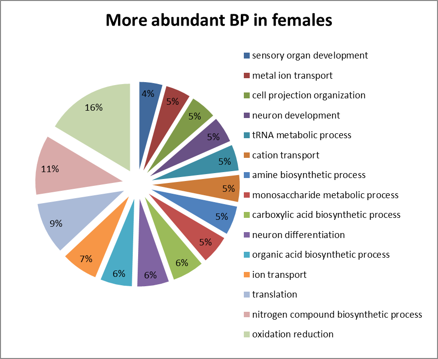
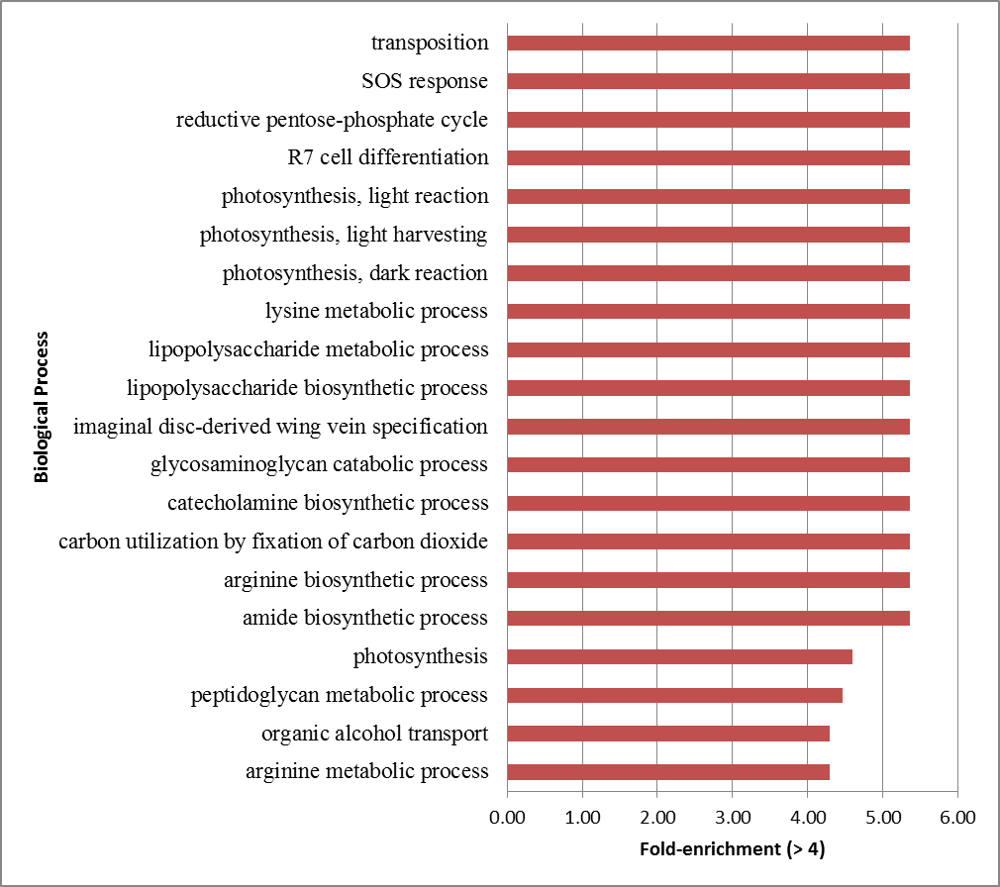

#The Geoduck Transcriptome

Created by Edgar Lopez (edlopez@cicese.edu.mx)

_____________

First, I got the sequence files  Geo-Female-full-with-Match-join.csv and GeoF-Annotation-SP-join-F-M-match.csv from [link](https://github.com/sr320/course-btea/tree/master/analyses).

Second, the duplicates were removed and classified as common in both sex and only female using excel.

Third, Both excel files were uploaded as background list and genelist in DAVID webpage. We selected Gene Ontology and list Biological Process (BP). The following is a pagescreen:

We click in chart and exported data as .txt.

Fourth, we tried paste de GO in REVIGO but we can´t obtain results because to network failure.

Finally, we do charts with the ontological data:

## To Be continued...
